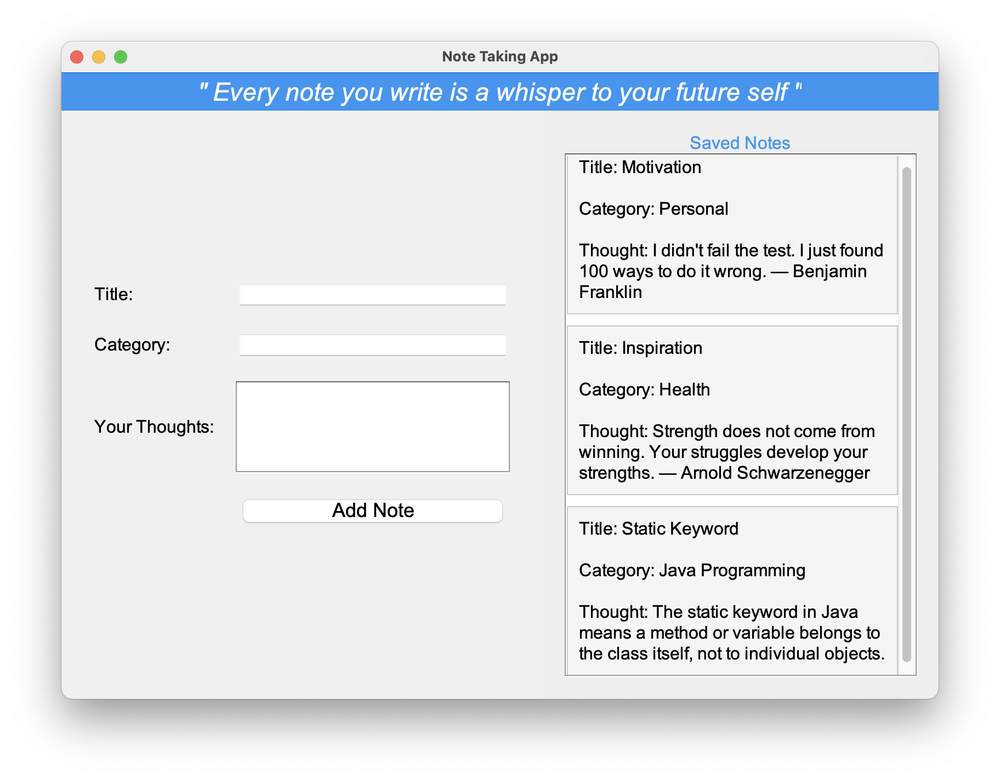
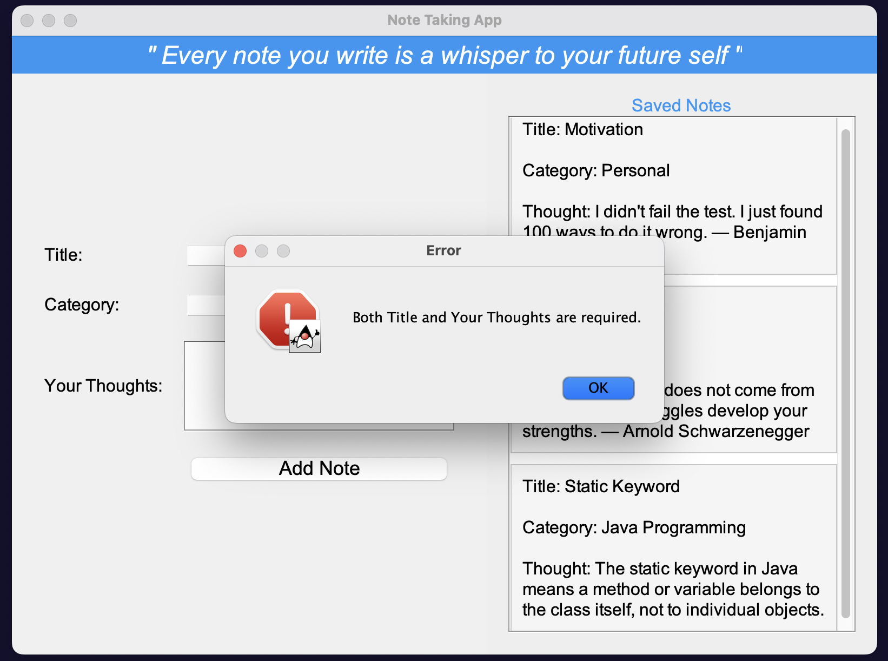

# Java Notes Taking Application 📝

This is a **Java-based Notes Taking Application** developed primarily for two purposes:

- To **revise and reinforce Java programming concepts**.
- To **explore the use of AI assistance** in GUI design and implementation.

The application provides a clean and simple user interface that allows users to create and view notes. It's designed with basic object-oriented principles and incorporates a GUI built with the help of AI-generated suggestions.

---

## 🚀 Features

- Create and add notes to a .json file.
- Lightweight Java GUI.
- Designed for easy extensibility (database integration, tagging, etc.).
- Developed as a learning tool for both Java and AI-assisted development.

---

## 📸 Screenshots

> Below are screenshots of the application.

### App GUI

### Error popup box

---

## 🛠️ Planned updates

- Add persistent storage solution using Database.
- Implement note delete and edit functionality.
- User account feature.
